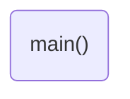

# Program: Blink Rate Toggler
**Author:** John M. Larkin <jlarkin@whitworth.edu>  
**Date:** December 31, 2020

**Modified by:**  
**Date:**

**Purpose:** This program flashes an LED with the rate toggled by a button.

## Configuration
Designed for bare metal Mbed OS 6 (enabled through `mbed_app.json`).

## Hardware
### Internal
* LED1 (DigitalOut) as button press indicator
* LED4 (DigitalOut) as heart beat

### External
* p7 (DigitalIn) <-- momentary push button <-- ????

## Flow

